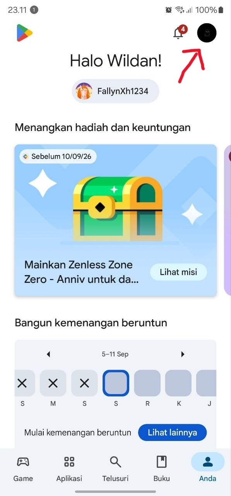
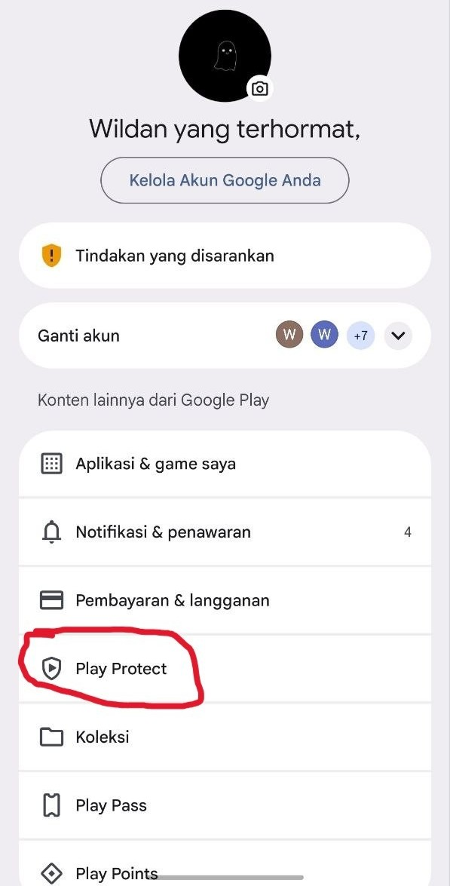
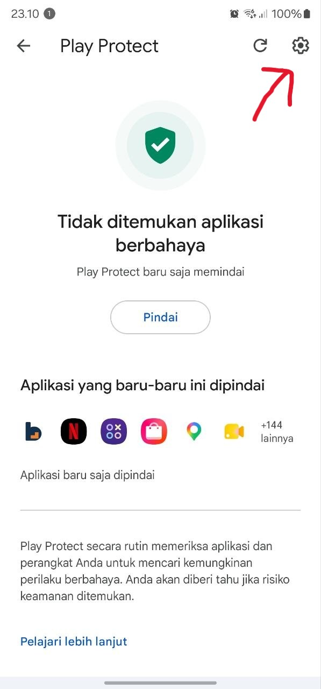
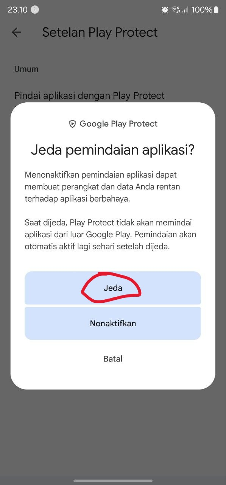
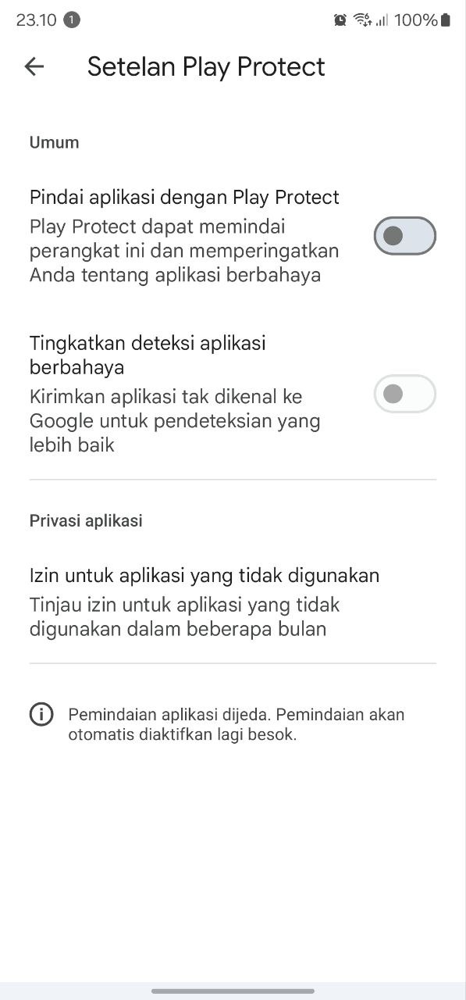

# BrainXP

BrainXP menukar waktu belajar dengan waktu bermain. Pengguna memfoto catatan pelajaran atau mengunggah dokumen, server membaca materi itu dan menyusun soal darinya, lalu setiap jawaban yang benar menambah saldo waktu bermain. Ketika saldo habis, aplikasi hiburan yang sudah dipilih akan terkunci sampai saldonya diisi lagi dengan belajar.

Aplikasi ini punya dua mode yang dipilih saat pengaturan awal:

**Mode Keluarga** memisahkan peran ke dua HP. Orang tua memegang aturan dari HP-nya sendiri: memilih aplikasi mana yang dikunci di HP anak, mengatur jatah harian, dan melihat laporan belajar. HP anak dipasangkan lewat kode enam digit dan tidak bisa mengubah aturan apa pun.

**Mode Pribadi** dipakai satu orang untuk mengatur dirinya sendiri. Pelonggaran aturan baru berlaku besok, supaya keputusan yang diambil saat sedang ingin bermain tidak langsung berlaku saat itu juga.

## Memasang APK

Berkas `BrainXP-v1.0.apk` berukuran 5,8 MB dan memuat keempat arsitektur CPU (arm64-v8a, armeabi-v7a, x86, x86_64), jadi bisa dipasang di HP fisik maupun emulator tanpa varian terpisah. Perangkat minimal Android 10 (API 29).

Pemasangan di luar Google Play memerlukan tiga langkah di bawah ini. Sebaiknya dibaca sampai selesai sebelum mulai, karena langkah pertama yang paling sering membuat pemasangan berhenti di tengah.

### 1. Jeda pemindaian Play Protect

BrainXP meminta izin akses penggunaan, izin tampil di atas aplikasi lain, dan menyediakan layanan aksesibilitas. Ketiganya dibutuhkan supaya aplikasi ini bisa mengetahui aplikasi apa yang sedang dibuka dan menampilkan layar penguncian di atasnya. Masalahnya, kombinasi izin yang sama juga dipakai perangkat lunak berbahaya, sehingga Google Play Protect menolak memasang aplikasi mana pun dengan pola izin tersebut jika berasal dari luar Play Store.

Pesan yang muncul berbunyi bahwa Play Protect belum pernah melihat aplikasi dari pengembang ini. Itu pemeriksaan reputasi, bukan hasil pemindaian ancaman, dan tidak menandakan ada masalah pada berkas APK-nya. Pada sebagian perangkat pemasangan langsung dihentikan dengan pesan "Aplikasi tidak terinstal", sehingga pemindaiannya perlu dijeda lebih dulu.

1. Buka Google Play Store, lalu ketuk foto profil di sudut kanan atas.
2. Pilih **Play Protect**.
3. Ketuk ikon gerigi di sudut kanan atas untuk membuka **Setelan Play Protect**.
4. Matikan **Pindai aplikasi dengan Play Protect**, lalu pilih **Jeda** pada dialog konfirmasi.

Pilih **Jeda**, bukan **Nonaktifkan**. Play Protect akan menyalakan pemindaiannya sendiri sehari kemudian, jadi tidak ada setelan keamanan yang tertinggal dalam keadaan mati.

| Ketuk foto profil | Pilih Play Protect | Buka setelan | Pilih Jeda | Pemindaian dijeda |
|---|---|---|---|---|
|  |  |  |  |  |

### 2. Izinkan pemasangan dari sumber berkas

Buka berkas APK dari aplikasi tempat berkasnya berada, misalnya Files, Chrome, atau notifikasi unduhan. Android akan menolak pada percobaan pertama dan menawarkan pengaturan **Izinkan dari sumber ini**. Aktifkan untuk aplikasi tersebut, lalu kembali dan buka berkasnya lagi.

Jika APK diunduh dari Google Drive, Drive menampilkan pesan bahwa berkas tidak dapat dipindai virus. Pesan itu muncul untuk semua APK dan tidak mengubah isi berkasnya.

### 3. Pasang aplikasinya

Setelah terpasang, pemindaian Play Protect boleh dinyalakan lagi dari layar yang sama, atau dibiarkan karena akan aktif otomatis sehari kemudian. Aplikasi yang sudah terpasang tetap berjalan normal.

Sebagai alternatif, jika perangkat penguji terhubung ke komputer dan Android SDK tersedia, pemasangan lewat `adb install BrainXP-v1.0.apk` tidak melewati Play Protect sama sekali sehingga tidak memerlukan langkah pertama.

## Menjalankan dari source code

Buka folder proyek di Android Studio, tunggu Gradle sync selesai, lalu jalankan konfigurasi `app`. Android Studio akan mengunduh sendiri dependensi yang diperlukan pada sync pertama.

Lewat terminal:

```
./gradlew installDebug          # pasang ke perangkat yang terhubung
./gradlew assembleDebug         # hasilkan APK debug
./gradlew assembleRelease       # hasilkan APK rilis yang sudah dipangkas R8
```

APK hasil build ada di `app/build/outputs/apk/`. Berkas `local.properties` tidak disertakan dalam arsip source code karena isinya jalur SDK di komputer masing masing. Android Studio membuatnya otomatis; kalau membuild lewat terminal, buat berkas itu di akar proyek dengan satu baris:

```
sdk.dir=/jalur/ke/Android/Sdk
```

## Izin sistem yang wajib diberikan

Bagian ini menentukan apakah fitur inti aplikasi bisa dinilai atau tidak. Tanpa dua izin pertama, aplikasi tetap terbuka dan bisa dijelajahi, tetapi penguncian aplikasi tidak akan pernah berjalan.

| Izin | Status | Kegunaan |
|---|---|---|
| Akses penggunaan | Wajib | Mengetahui aplikasi mana yang sedang dibuka, supaya waktu bermain terhitung dan penguncian bisa dipicu |
| Tampil di atas aplikasi lain | Wajib | Menampilkan layar penguncian di atas aplikasi yang dibatasi |
| Notifikasi | Disarankan | Pengingat sisa waktu dan pemberitahuan soal yang sudah siap |
| Abaikan optimasi baterai | Disarankan | Menjaga layanan penghitung waktu tetap hidup saat layar mati |
| Layanan aksesibilitas | Opsional | Metode deteksi alternatif. Tidak perlu diaktifkan karena metode bawaan memakai akses penggunaan |

Kedua izin wajib itu tidak bisa diberikan lewat dialog biasa, harus dari halaman Pengaturan sistem. Aplikasi sudah menyediakan layar **Siapkan izin** yang menuntun langkah demi langkah dan membuka halaman Pengaturan yang tepat untuk tiap izin, jadi tidak perlu mencarinya manual. Layar itu muncul pada pengaturan awal dan bisa dibuka lagi kapan saja dari tab Pengaturan.

## Akun demo

Mode Pribadi dan HP orang tua memerlukan akun. HP anak tidak memerlukan akun sama sekali, cukup memasukkan kode pemasangan yang diterbitkan dari HP orang tua.

| Peran | Email | Kata sandi |
|---|---|---|
| Orang tua atau Mode Pribadi | _isi sebelum dikumpulkan_ | _isi sebelum dikumpulkan_ |

Akun demo sudah berisi materi, riwayat, dan saldo waktu supaya setiap layar terlihat sebagaimana mestinya. Pendaftaran akun baru juga tersedia di aplikasi, tetapi akun baru akan tampil kosong sampai ada materi yang diunggah.

Untuk mencoba Mode Keluarga secara utuh diperlukan dua perangkat, misalnya satu HP fisik sebagai orang tua dan satu emulator sebagai anak. Alurnya: masuk sebagai orang tua, buat profil anak, terbitkan kode pemasangan, lalu masukkan kode itu di perangkat kedua.

## Spesifikasi lingkungan pengujian

Toolchain yang dipakai membangun dan menguji:

| Komponen | Versi |
|---|---|
| JDK | 17 |
| Gradle | 9.5.0 |
| Android Gradle Plugin | 9.3.2 |
| Kotlin | 2.2.10 |
| Compose BOM | 2026.02.01 |
| compileSdk dan targetSdk | 37 |
| minSdk | 29 (Android 10) |

Pustaka utama: Jetpack Compose dengan Navigation 3, Hilt untuk dependency injection, Room untuk basis data lokal, Retrofit dengan kotlinx.serialization untuk jaringan, WorkManager untuk unggahan latar belakang, dan DataStore untuk preferensi.

Perangkat yang dipakai menguji:

| Perangkat | Android | API |
|---|---|---|
| Samsung SM-S908E | 14 | 34 |
| Android Emulator, Pixel 8 x86_64 | 15 | 35 |

Aplikasi memanggil backend di `https://brainxp-api.satu-miliar-pertama-di-2027.biz.id/`. Koneksi internet wajib ada.

## Struktur proyek

Satu modul Gradle bernama `app`, dibagi menurut peran:

```
app/src/main/java/com/example/brainxp/
├── blocking/      layanan latar belakang, deteksi aplikasi depan, layar penguncian
├── core/          jaringan, basis data, izin, waktu, komponen UI bersama
├── data/          repositori dan pemetaan respons server
├── di/            modul Hilt
├── domain/        model dan aturan yang tidak bergantung Android
└── feature/       satu paket per layar beserta ViewModel-nya
```

## Menjalankan pengujian

```
./gradlew test                  # 431 unit test
./gradlew detekt                # analisis statis
./gradlew lintDebug             # Android lint
./gradlew connectedAndroidTest  # tes instrumentasi, perlu perangkat terhubung
```

Tes instrumentasi memasang ulang aplikasi dan menghapus datanya, jadi sesi yang sedang masuk akan hilang setelahnya.

## Yang perlu diketahui

Pembacaan materi dan penyusunan soal berjalan di server, bukan di perangkat. Tidak ada model OCR atau AI yang dibundel di dalam APK. Karena itu tanpa internet aplikasi tidak bisa menunjukkan fitur intinya.

Penilaian jawaban dan perhitungan saldo waktu juga dilakukan server. Aplikasi tidak pernah memutuskan sendiri sebuah jawaban benar atau salah, dan tidak pernah menambah saldonya sendiri.

APK rilis ini ditandatangani dengan sertifikat debug bawaan Android SDK. Itu cukup untuk pemasangan langsung dan pengujian, tetapi untuk distribusi di Google Play diperlukan kunci penandatanganan tersendiri.

## Lisensi

Dirilis di bawah Lisensi MIT. Teks lengkapnya ada di berkas [LICENSE](LICENSE).
